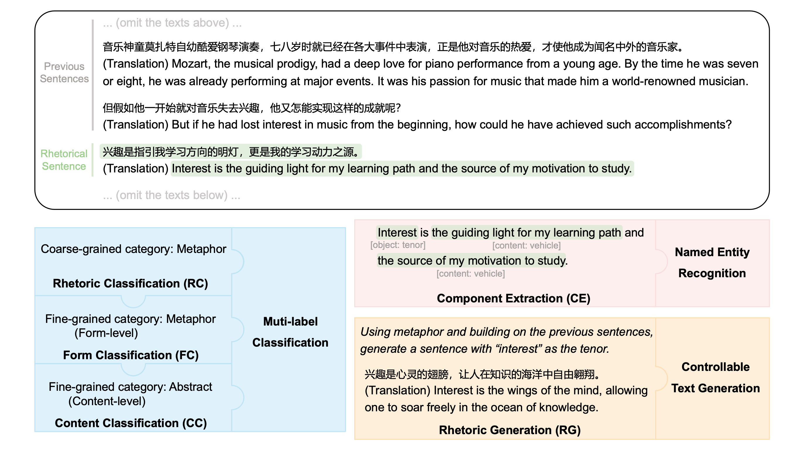

# CERD

This is the official repository for the paper *CERD: A Comprehensive Chinese Rhetoric Dataset for Rhetorical Understanding and Generation in Essays*. (Accepted by EMNLP 2024 Findings)

\[Dataset\] | \[[Paper](https://aclanthology.org/2024.findings-emnlp.395.pdf)\]



# Code and Dataset

## Dataset

For now, please contact via email at nwliu@stu.ecnu.edu.cn

## Fine-tuning

To fine-tune RoBERTa, simply run the `scripts/train_roberta.sh` script. Note that the task type can be selected from the following options: `Rhetoric Classification`, `Form Classification`, `Content Classification`, and `Component Extraction`.

To fine-tune Qwen1.5, first use the helper functions in `src/preprocess/chat.py` to convert the dataset into an instruction-following format using our pre-defined chat templates in `templates/`. Then, simply run the `scripts/train_qwen.sh` script.

## Evaluation

For inference, call the method `evaluate()` of `GPTEvaluator`, `QwenEvaluator`, and `RoBERTaEvaluator` in `src/evaluator/`. For example, to evaluate RoBERTa on the rhetoric classification task, run the following code:

```python
from src.typing import TaskType

evaluator = RoBERTaEvaluator(
    model_name_or_path='path/to/roberta',
    task_type=TaskType.RC,
    test_set_path='path/to/test_set',
    batch_size=4,
    save_results=True,
    save_path='path/to/save_results'
)
evaluator.evaluate()
```

Apart from the evaluators above, you can implement your own evaluator by inheriting the `BaseEvaluator` class in `src/evaluator/base.py`. Specifically, you need to implement three abstract methods: `evaluate_classification_task()`, `evaluate_extraction_task()`, and `evaluate_generation_task()`. Afterward, simply call the `evaluate()` method to evaluate your models. Here is a simple snippet for illustration.

```python
# 1. Implement your own evaluator
class YourCustomEvaluator(BaseEvaluator):
    def __init__(
        self,
        model_name_or_path: str,
        task_type: TaskType,
        test_set_path: str,
        batch_size: int = 1,
        save_results: bool = False,
        save_path: str = None,
        **kwargs
    ):

    def evaluate_classification_task(self, sentences: List[str]) -> List[List[int]]:
        # TODO implement the abstract method
        pass

    def evaluate_extraction_task(self, sentences: List[str]) -> List[List[str]]:
        # TODO implement the abstract method
        pass

    def evaluate_generation_task(self, rhetoric_list: List[str], object_list: List[str], previous_sentences_list: List[List[str]]) -> List[str]:
        # TODO implement the abstract method
        pass

# 2. Run the evaluate() method
evaluator = YourCustomEvaluator(...)
evaluator.evaluate()
```

# Citation

```bibtex
@inproceedings{liu-etal-2024-cerd,
    title = "{CERD}: A Comprehensive {C}hinese Rhetoric Dataset for Rhetorical Understanding and Generation in Essays",
    author = "Liu, Nuowei  and
      Chen, Xinhao  and
      Wu, Hongyi  and
      Sun, Changzhi  and
      Lan, Man  and
      Wu, Yuanbin  and
      Bai, Xiaopeng  and
      Mao, Shaoguang  and
      Xia, Yan",
    editor = "Al-Onaizan, Yaser  and
      Bansal, Mohit  and
      Chen, Yun-Nung",
    booktitle = "Findings of the Association for Computational Linguistics: EMNLP 2024",
    month = nov,
    year = "2024",
    address = "Miami, Florida, USA",
    publisher = "Association for Computational Linguistics",
    url = "https://aclanthology.org/2024.findings-emnlp.395/",
    doi = "10.18653/v1/2024.findings-emnlp.395",
    pages = "6744--6759"
}
```